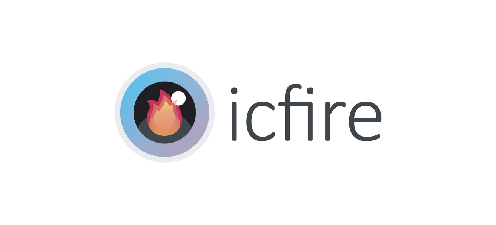

## Contributors
<table>
  <tr>
    <td align="center"><a href="https://github.com/Szaqk"><b>Jakub Olszewski</b></td>
    <td align="center"><a href="https://github.com/lukaszstefanowski97"><b>Łukasz Stefanowski</b></td>
    <td align="center"><a href="https://github.com/Bjornskjald"><b>Bjornskjald</b></td>
    <td align="center"><a href="https://github.com/Meandester"><b>Filip Sęk</b></td>
    <td align="center"><a href="https://github.com/Torianna"><b>Klaudia Góralska</b></td>
    <td align="center"><a href="https://github.com/MichauMat"><b>Michał Matera</b></td>
  </tr>
</table>